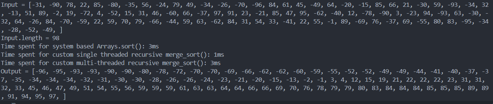

## 1. Research about ConcurrencyHashMap, explain and give example
   
ConcurrentHashMap diperkenalkan di JDK 1.5 milik paket java.util.concurrent ConcurrentHashMap adalah implementasi antarmuka Peta di Java yang aman untuk thread, yang berarti beberapa thread dapat mengaksesnya secara bersamaan tanpa masalah sinkronisasi apa pun dan ini juga  sebagai alternatif yang dapat diskalakan untuk kelas HashMap tradisional.

Salah satu fitur utama ConcurrentHashMap adalah ia menyediakan penguncian yang terperinci, artinya ia hanya mengunci bagian peta yang sedang diubah, bukan keseluruhan peta. Hal ini membuatnya sangat terukur dan efisien untuk operasi bersamaan. 
import java.util.concurrent.ConcurrentHashMap;


**Example:**
``` java
public class Concurrent {
	public static void main(String[] args) {
		ConcurrentHashMap<String, Integer> map = new ConcurrentHashMap<>();

		// Adding elements to the map
		map.put("A", 1);
		map.put("B", 2);
		map.put("C", 3);

		System.out.println("Map size: " + map.size());

		// Getting values from the map
		int valueA = map.get("A");
		System.out.println("Value of A: " + valueA);

		// Removing elements from the map
		map.remove("B");
		System.out.println("Map size: " + map.size());
	}
}
```


## 1. Explain equal() and hashcode() method. Explain and give Example

In Java, the equals() and hashCode() methods are defined in the Object class, so every Java class inherits default implementations of these methods. The equals() method is used to check if two objects are equal, while the hashCode() method generates a unique integer identifier for an object. If two objects are considered equal by the equals() method, they must produce the same hash code. This consistency is essential for the proper functioning of hash-based collections like HashMap and HashSet, which depend on these methods to compare objects and manage their storage effectively.

Java hashCode() and equals() method are used in Hash table based implementations in java for storing and retrieving data.

Example:

**Equals**

``` java
package run.java;

public class DataKey {

	private String name;
	private int id;

	public int getId() {
		return id;
	}

	public void setId(int id) {
		this.id = id;
	}
	public String getName() {
		return name;
	}

	public void setName(String name) {
		this.name = name;
	}

	@Override
	public String toString() {
		return "DataKey [name=" + name + ", id=" + id + "]";
	}

}
```
``` java
package run.java;

import java.util.HashMap;
import java.util.Map;

public class HashCodeEqualExample {

	public static void main(String[] args) {
		Map<DataKey, Integer> hm = getAllData();

		DataKey dk = new DataKey();
		dk.setId(1);
		dk.setName("Pankaj");
		System.out.println(dk.hashCode());

		Integer value = hm.get(dk);

		System.out.println(value);

	}

	private static Map<DataKey, Integer> getAllData() {
		Map<DataKey, Integer> hm = new HashMap<>();

		DataKey dk = new DataKey();
		dk.setId(1);
		dk.setName("Pankaj");
		System.out.println(dk.hashCode());

		hm.put(dk, 10);

		return hm;
	}

}
```


When we run above program, it will print null. It’s because Object hashCode() method is used to find the bucket to look for the key. Since we don’t have access to the HashMap keys and we are creating the key again to retrieve the data, you will notice that hash code values of both the objects are different and hence value is not found.