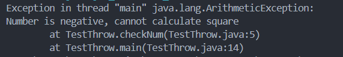

Q1 : Research and explain try-with-resources ?

### Definition
The try-with-resources statement in Java is a try statement that declares one or more resources. A resource is an object that must be closed after the program is finished with it.

### Function
The try-with-resources statement ensures that each resource is automatically closed at the end of the statement. Any object that implements `java.lang.AutoCloseable`, which includes all objects that implement `java.io.Closeable`, can be used as a resource. This feature simplifies the management of resource closure, ensuring that resources are closed properly without needing explicit `finally` blocks.

Q2 : Throw vs throws, give example

### Throw

The `throw` keyword in Java is used to throw an exception explicitly in the code, inside the function or the block of code.

#### Example:

``` java
public class TestThrow {  
    //defining a method  
    public static void checkNum(int num) {  
        if (num < 1) {  
            throw new ArithmeticException("\nNumber is negative, cannot calculate square");  
        }  
        else {  
            System.out.println("Square of " + num + " is " + (num*num));  
        }  
    }  
    //main method  
    public static void main(String[] args) {  
            new TestThrow();  
            TestThrow.checkNum(-3);  
            System.out.println("Rest of the code..");  
    }  
}  
```



### throws

Java `throws` keyword is used in the method signature to declare an exception which might be thrown by the function while the execution of the code.


#### Example:

``` java
public class TestThrows {  
    //defining a method  
    public static int divideNum(int m, int n) throws ArithmeticException {  
        int div = m / n;  
        return div;  
    }  
    //main method  
    public static void main(String[] args) {  
        try {  
            System.out.println(TestThrows.divideNum(45, 0));  
        }  
        catch (ArithmeticException e){  
            System.out.println("\nNumber cannot be divided by 0");  
        }  
          
        System.out.println("Rest of the code..");  
    }  
}  
```

