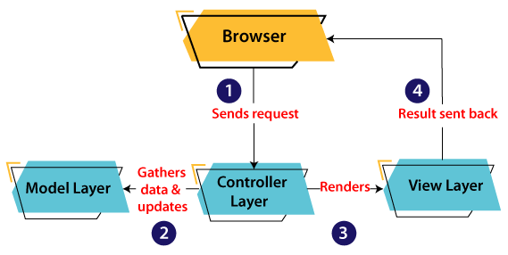
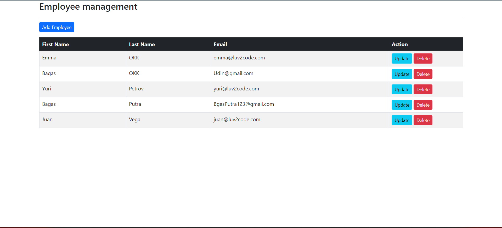

## Do the example again (Spring MVC)

The MVC pattern architecture consists of three layers:

**Model:** It represents the business layer of application. It is an object to carry the data that can also contain the logic to update controller if data is changed.

**View:** It represents the presentation layer of application. It is used to visualize the data that the model contains.

**Controller:** It works on both the model and view. It is used to manage the flow of application, i.e. data flow in the model object and to update the view whenever data is changed.

the Model contains the simple Java classes, the View used to display the data and the Controller contains the servlets. Due to this separation the user requests are processed as follows:


1. A client (browser) sends a request to the controller on the server side, for a page.

2. The controller then calls the model. It gathers the requested data.

3. Then the controller transfers the data retrieved to the view layer.

4. Now the result is sent back to the browser (client) by 
the view.

## Code

**Controller**

This controller handles CRUD (Create, Read, Update, Delete) operations for employees. It allows the user to view a list of employees, add a new employee, update an existing employee, and delete an employee, all through corresponding views (HTML pages). The operations are made persistent through the EmployeeService, which interacts with the underlying data storage.

``` java
package come.fsoft.lecture5.findomvc.controller;

import come.fsoft.lecture5.findomvc.model.Employee;
import come.fsoft.lecture5.findomvc.service.EmployeeService;
import lombok.AllArgsConstructor;
import org.springframework.stereotype.Controller;
import org.springframework.ui.Model;
import org.springframework.web.bind.annotation.*;

import java.util.List;

@AllArgsConstructor
@Controller
@RequestMapping("/employees")
public class EmployeeController {

    private final EmployeeService employeeService;

    @GetMapping("/list")
    public String listEmployees(Model theModel) {

        // get the employees from db
        List<Employee> theEmployees = employeeService.findAll();

        // add to the spring model
        theModel.addAttribute("employees", theEmployees);

        return "employees/list-employees";
    }

    @GetMapping("/showFormForAdd")
    public String showFormForAdd(Model theModel) {

        // create model attribute to bind form data
        Employee theEmployee = new Employee();

        theModel.addAttribute("employee", theEmployee);

        return "employees/employee-form";
    }

    @PostMapping("/showFormForUpdate")
    public String showFormForUpdate(@RequestParam("employeeId") int id,
                                    Model theModel) {

        // get the employee from the service
        Employee theEmployee = employeeService.findById(id);

        // set employee as a model attribute to pre-populate the form
        theModel.addAttribute("employee", theEmployee);

        // send over to our form
        return "employees/employee-form";
    }

    @PostMapping("/save")
    public String saveEmployee(@ModelAttribute("employee") Employee theEmployee) {

        // save the employee
        employeeService.save(theEmployee);

        // use a redirect to prevent duplicate submissions
        return "redirect:/employees/list";
    }

    @PostMapping("/delete")
    public String delete(@RequestParam("employeeId") int id) {

        // delete the employee
        employeeService.deleteById(id);

        // redirect to /employees/list
        return "redirect:/employees/list";

    }
}
```

**Model**

entity class is likely used in the application to perform CRUD operations on the employee table, interacting with the database via the EmployeeService and controller classes.

``` java
package come.fsoft.lecture5.findomvc.model;

import jakarta.persistence.*;
import lombok.Getter;
import lombok.Setter;

@Entity
@Table(name="employee")
@Getter
@Setter
public class Employee {

	// define fields
	
	@Id
	@GeneratedValue(strategy=GenerationType.IDENTITY)
	@Column(name="id")
	private int id;
	
	private String firstName;
	
	private String lastName;
	
	private String email;
}
```

**Repository**

The EmployeeRepository interface is a special Spring Data JPA component that allows you to perform database operations on the Employee entity. It automatically provides methods like save, find, delete, etc., without needing to write them yourself.

Additionally, it has a custom method findAllByOrderByLastNameAsc() that retrieves all employees from the database and sorts them by their last name in ascending order. This interface helps you easily manage employee data in your application.

``` java
package come.fsoft.lecture5.findomvc.repository;

import come.fsoft.lecture5.findomvc.model.Employee;
import org.springframework.data.jpa.repository.JpaRepository;
import org.springframework.stereotype.Repository;

import java.util.List;

@Repository
public interface EmployeeRepository extends JpaRepository<Employee, Integer> {
    List<Employee> findAllByOrderByLastNameAsc();
}
```

**IMPL**

The EmployeeServiceImpl class interacts with the EmployeeRepository to perform database operations like retrieving, saving, and deleting employee records. It serves as the business layer, ensuring that the application’s logic is handled appropriately before interacting with the database.

``` java
package come.fsoft.lecture5.findomvc.service.impl;

import come.fsoft.lecture5.findomvc.model.Employee;
import come.fsoft.lecture5.findomvc.repository.EmployeeRepository;
import come.fsoft.lecture5.findomvc.service.EmployeeService;
import lombok.AllArgsConstructor;
import org.springframework.stereotype.Service;

import java.util.List;

@Service
@AllArgsConstructor
public class EmployeeServiceImpl implements EmployeeService {

    private final EmployeeRepository employeeRepository;

    @Override
    public List<Employee> findAll() {
        return employeeRepository.findAllByOrderByLastNameAsc();
    }

    @Override
    public Employee findById(int theId) {
        return employeeRepository.findById(theId).orElseThrow();
    }

    @Override
    public void save(Employee theEmployee) {
        employeeRepository.save(theEmployee);
    }

    @Override
    public void deleteById(int theId) {
        employeeRepository.deleteById(theId);
    }

}
```

**Service**

defines the core operations (CRUD: Create, Read, Update, Delete) that any service dealing with employees must implement. It ensures consistency across different implementations by mandating these methods. The actual logic for these operations is provided by the class that implements this interface.

``` java
package come.fsoft.lecture5.findomvc.service;

import come.fsoft.lecture5.findomvc.model.Employee;

import java.util.List;

public interface EmployeeService {
    List<Employee> findAll();

    Employee findById(int theId);

    void save(Employee theEmployee);

    void deleteById(int theId);
}
```

**findoMvcApplication**

Like main to run entire application, setting up the necessary configurations, starting the web server, and making the application ready to handle requests.

``` java
package come.fsoft.lecture5.findomvc;

import org.springframework.boot.SpringApplication;
import org.springframework.boot.autoconfigure.SpringBootApplication;

@SpringBootApplication
public class FindoMvcApplication {

	public static void main(String[] args) {
		SpringApplication.run(FindoMvcApplication.class, args);
	}

}

```

**index**
automatically redirects the user on the index page.
``` java
<meta http-equiv="refresh"
      content="0; URL='employees/list'">
```

**employee-form**

displays a form for creating or updating an employee.

``` java
<!DOCTYPE HTML>
<html lang="en" xmlns:th="http://www.thymeleaf.org">

<head>
    <!-- Required meta tags -->
    <meta charset="utf-8">
    <meta name="viewport" content="width=device-width, initial-scale=1, shrink-to-fit=no">

    <!-- Bootstrap CSS -->
    <link href="https://cdn.jsdelivr.net/npm/bootstrap@5.2.2/dist/css/bootstrap.min.css" rel="stylesheet" integrity="sha384-Zenh87qX5JnK2Jl0vWa8Ck2rdkQ2Bzep5IDxbcnCeuOxjzrPF/et3URy9Bv1WTRi" crossorigin="anonymous">

    <title>Save Employee</title>
</head>

<body>

    <div class="container">

        <h3>Employee management</h3>
        <hr>

        <p class="h4 mb-4">Save Employee</p>

        <form action="#" th:action="@{/employees/save}"
                         th:object="${employee}" method="POST">

            <!-- Add hidden form field to handle update -->
            <input type="hidden" th:field="*{id}" />

            <input type="text" th:field="*{firstName}"
                   class="form-control mb-4 w-25" placeholder="First name">

            <input type="text" th:field="*{lastName}"
                   class="form-control mb-4 w-25" placeholder="Last name">

            <input type="text" th:field="*{email}"
                   class="form-control mb-4 w-25" placeholder="Email">

            <button type="submit" class="btn btn-info col-2">Save</button>

        </form>

        <hr>
        <a th:href="@{/employees/list}">Back to Employees List</a>

    </div>
</body>
</html>
```

**list-employees**

displays a list of all employees in a table format.

``` java
<!DOCTYPE HTML>
<html lang="en" xmlns:th="http://www.thymeleaf.org">

<head>
    <!-- Required meta tags -->
    <meta charset="utf-8">
    <meta name="viewport" content="width=device-width, initial-scale=1, shrink-to-fit=no">

    <!-- Bootstrap CSS -->
	<link href="https://cdn.jsdelivr.net/npm/bootstrap@5.2.2/dist/css/bootstrap.min.css" rel="stylesheet" integrity="sha384-Zenh87qX5JnK2Jl0vWa8Ck2rdkQ2Bzep5IDxbcnCeuOxjzrPF/et3URy9Bv1WTRi" crossorigin="anonymous">

	<title>Employee management</title>
</head>

<body>

<div class="container">

	<h3>Employee management</h3>
	<hr>

	<!-- Add a button -->
	<a th:href="@{/employees/showFormForAdd}"
		class="btn btn-primary btn-sm mb-3">
		Add Employee
	</a>

	<table class="table table-bordered table-striped">
		<thead class="table-dark">
			<tr>
				<th>First Name</th>
				<th>Last Name</th>
				<th>Email</th>
				<th>Action</th>
			</tr>
		</thead>
		
		<tbody>
			<tr th:each="tempEmployee : ${employees}">
			
				<td th:text="${tempEmployee.firstName}" />	
				<td th:text="${tempEmployee.lastName}" />	
				<td th:text="${tempEmployee.email}" />

				<td>
					<div class="row">

						<div class="col-small">
							<!-- Add "update" button/link -->
							<form action="#" th:action="@{/employees/showFormForUpdate}" method="POST">

								<input type="hidden" name="employeeId" th:value="${tempEmployee.id}" />
								<button type="submit" class="btn btn-info btn-sm me-1" style="float:left;">Update</button>

							</form>

							<!-- Add "delete" button/link -->
							<form action="#" th:action="@{/employees/delete}" method="POST">

								<input type="hidden" name="employeeId" th:value="${tempEmployee.id}" />
								<button type="submit" class="btn btn-danger btn-sm"
										onclick="if (!(confirm('Are you sure you want to delete this employee?'))) return false">
									Delete
								</button>

							</form>
						</div>

					</div>
				</td>

			</tr>
		</tbody>		
	</table>
	
</div>
	
</body>
</html>
```

**Output:**


