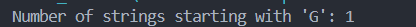

1. Count the number of strings in a list that start with a  specific letter using streams. Input : ["Red", "Green", "Blue", "Pink", "Brown“] and String = “G”
Output : 1

```java
import java.util.Arrays;
import java.util.List;

public class StreamExample {
    public static void main(String[] args) {

        List<String> colors = Arrays.asList("Red", "Green", "Blue", "Pink", "Brown");

        String target = "G";

        long count = colors.stream()
            .filter(s -> s.startsWith(target))  
            .count();                           

        System.out.println("Number of strings starting with '" + target + "': " + count);
    }
}

```

