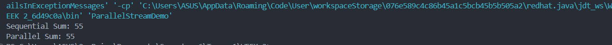

- Research about Parallel Stream.
  
**Define:** for the processing of stream operations in parallel, leveraging multiple CPU cores. This can lead to significant performance improvements for large datasets or computationally intensive operations.

**Function:** to create streams that execute in parallel and make use of multiple processor cores.

- When we use parallel stream? What is notice? Using parallel stream with demo sum list of number

we need to be very considerate when using parallel streams.

Parallelism can bring performance benefits in certain use cases. But parallel streams cannot be considered as a magical performance booster. **arrays are a great data source for parallel execution** because they bring the best possible locality and can split cheaply and evenly.

Parallel flow is unpredictable and complicated to use correctly. Almost any use of parallel flow can affect the performance of other unrelated system components in unpredictable ways.

### When to Use Parallel Stream

**Large Data Sets:** When working with large collections, parallel streams can reduce processing time by distributing tasks across multiple threads.

**CPU-Bound Tasks:** For tasks that are computationally intensive and not IO-bound.

**Independent Tasks:** When the tasks to be performed on each element are independent of each other.

### Important Considerations When Using Parallel Streams

**Thread Safety:** Make sure that the operations executed are thread-safe to prevent data corruption or inconsistencies.

**Overhead:** Parallel streams come with overhead from managing threads. For smaller collections, this overhead might outweigh any performance gains.

**Order:** Parallel streams don't guarantee the order of execution. If maintaining order is crucial, use sequential streams or other methods to ensure it.

**ForkJoinPool:** Parallel streams utilize the common ForkJoinPool. Adjusting this pool can offer better performance control.

**Resource Management:** Exercise caution with resource management, especially for IO operations in parallel streams.

**Splittable Data:** Data structures should be easily divisible to effectively take advantage of parallel processing.

``` java
import java.util.Arrays;
import java.util.List;

public class ParallelStreamDemo {
    public static void main(String[] args) {
        List<Integer> numbers = Arrays.asList(1, 2, 3, 4, 5, 6, 7, 8, 9, 10);

        // Sequential stream sum
        int sequentialSum = numbers.stream().reduce(0, Integer::sum);
        System.out.println("Sequential Sum: " + sequentialSum);

        // Parallel stream sum
        int parallelSum = numbers.parallelStream().reduce(0, Integer::sum);
        System.out.println("Parallel Sum: " + parallelSum);
    }
}
```
