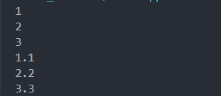
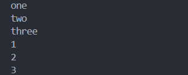

- Why we need serialization ?
  
It enables us to save the state of an object and recreate the object in a new location.

But much data in a Java program is not serial. An object can point to several other objects, the logical arrangement of the data is not serial.

Serialisers usually not only generate the data in a serial form, they provide metadata about how to reconstruct it in a non-serialised form, for example by adding tags which indicate what each piece of data represents. So you can not only reconstruct the data, you can reconstruct the internal linkages between the data elements.

Serialization is essential for several reasons:

- Persistence: It allows objects to be saved to a file or a database, enabling them to be restored later.

- Communication: It enables objects to be sent over a network or between different components of a distributed system.

- Caching: Serialized objects can be stored in a cache to improve performance by avoiding recomputation or reconstruction.


- Demo: Using Wildcards With Generics
  
The question mark (?) is known as the wildcard in generic programming. It represents an unknown type. The wildcard can be used in a variety of situations such as the type of a parameter, field, or local variable; sometimes as a return type. Unlike arrays, different instantiations of a generic type are not compatible with each other, not even explicitly. This incompatibility may be softened by the wildcard if ? is used as an actual type parameter.

### Types of wildcards in Java:

**Upper Bounded Wildcards:** 
``` java
import java.util.Arrays;
import java.util.List;

public class UpperDemo {

    public static void printNumbers(List<? extends Number> list) {
        for (Number num : list) {
            System.out.println(num);
        }
    }

    public static void main(String[] args) {
        List<Integer> integerList = Arrays.asList(1, 2, 3);
        List<Double> doubleList = Arrays.asList(1.1, 2.2, 3.3);

        printNumbers(integerList); 
        printNumbers(doubleList); 
    }
}
```


**Lower Bounded Wildcards:**
``` java
import java.util.Arrays;
import java.util.List;
import java.util.ArrayList;

public class LowerDemo {

    public static void addNumbers(List<? super Integer> list) {
        list.add(50);
        list.add(100);
    }

    public static void main(String[] args) {
        List<Number> numberList = new ArrayList<>(Arrays.asList(1.1, 2.2, 3.3));
        List<Object> objectList = new ArrayList<>(Arrays.asList("one", "two", "three"));

        addNumbers(numberList);
        addNumbers(objectList);

        System.out.println(numberList); 
        System.out.println(objectList); 
    }
}
```


**Unbounded Wildcard:**
``` java
import java.util.Arrays;
import java.util.List;

public class UnboundedDemo {

    public static void printList(List<?> list) {
        for (Object elem : list) {
            System.out.println(elem);
        }
    }

    public static void main(String[] args) {
        List<String> stringList = Arrays.asList("one", "two", "three");
        List<Integer> integerList = Arrays.asList(1, 2, 3);

        printList(stringList); 
        printList(integerList); 
    }
}
```


- What Is the serialVersionUID? Explain and give example


Simply put, we use the serialVersionUID attribute to remember versions of a Serializable class to verify that a loaded class and the serialized object are compatible.

The serialVersionUID attributes of different classes are independent. Therefore, it is not necessary for different classes to have unique values.
  
``` java
import java.io.Serializable;

public class Person implements Serializable {
    private static final long serialVersionUID = 1L;
    
    private String name;
    private int age;

    // Constructor
    public Person(String name, int age) {
        this.name = name;
        this.age = age;
    }

    // Getter for name
    public String getName() {
        return name;
    }

    // Setter for name
    public void setName(String name) {
        this.name = name;
    }

    // Getter for age
    public int getAge() {
        return age;
    }

    // Setter for age
    public void setAge(int age) {
        this.age = age;
    }

    // Override toString for better output readability
    @Override
    public String toString() {
        return "Person{name='" + name + "', age=" + age + "}";
    }

    public static void main(String[] args) {
        // Create a new Person object
        Person person = new Person("John Doe", 30);

        // Print the person object
        System.out.println(person);

        // Serialize and deserialize the object (additional code needed here for full demonstration)
    }
}
```

``` java
import java.io.*;

public class SerializationDemo {

    public static void main(String[] args) {
        Person person = new Person("John Doe", 30);

        // Serialize the object
        try (ObjectOutputStream oos = new ObjectOutputStream(new FileOutputStream("person.ser"))) {
            oos.writeObject(person);
        } catch (IOException e) {
            e.printStackTrace();
        }

        // Deserialize the object
        try (ObjectInputStream ois = new ObjectInputStream(new FileInputStream("person.ser"))) {
            Person deserializedPerson = (Person) ois.readObject();
            System.out.println("Deserialized Person: " + deserializedPerson);
        } catch (IOException | ClassNotFoundException e) {
            e.printStackTrace();
        }
    }
}
```


