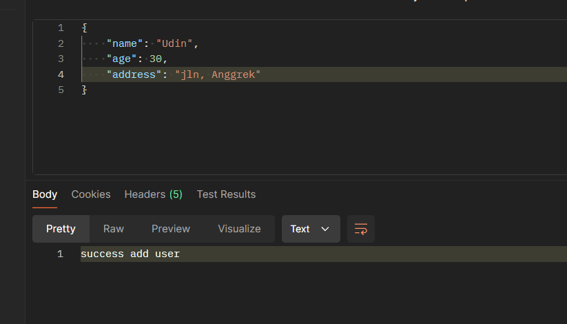
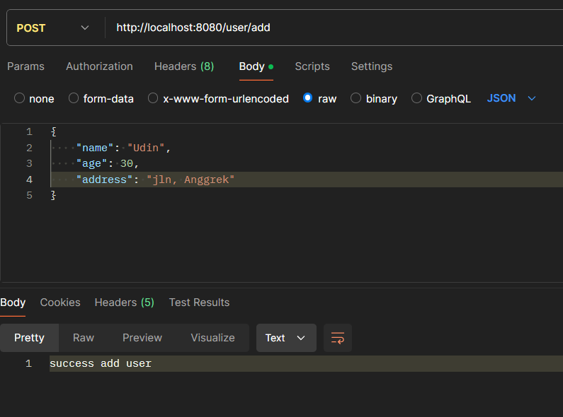
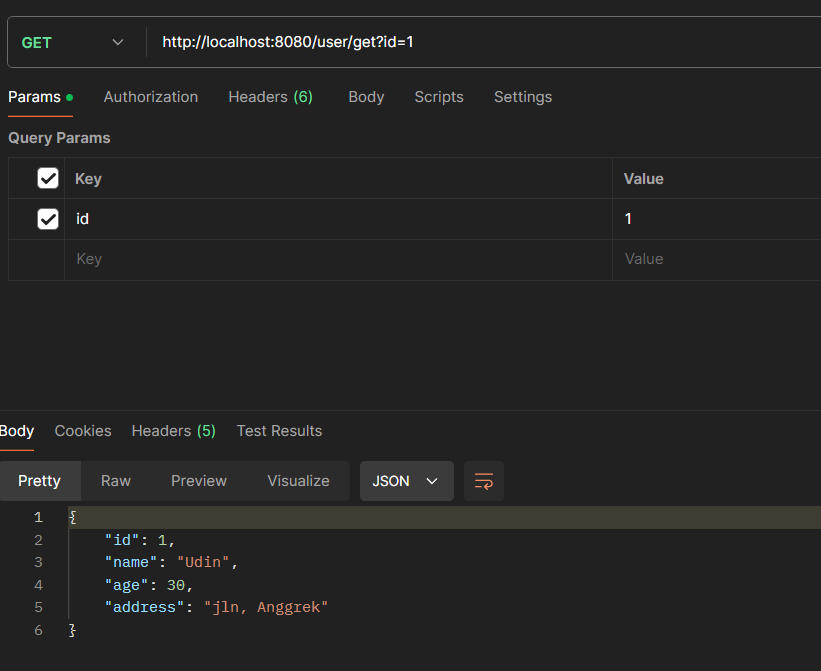
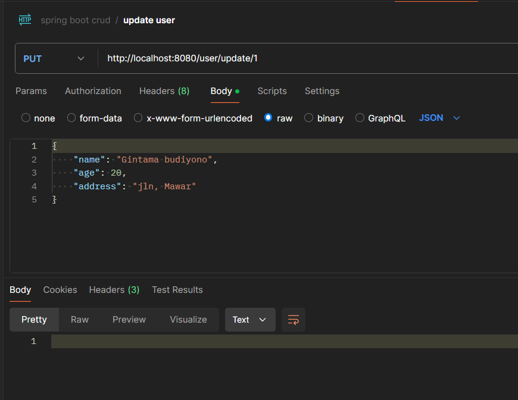
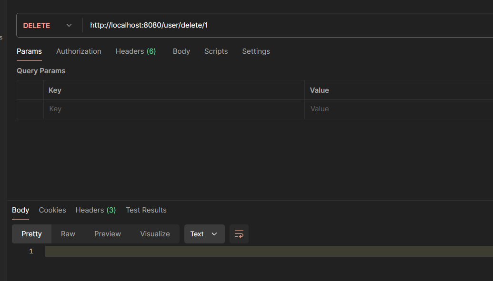
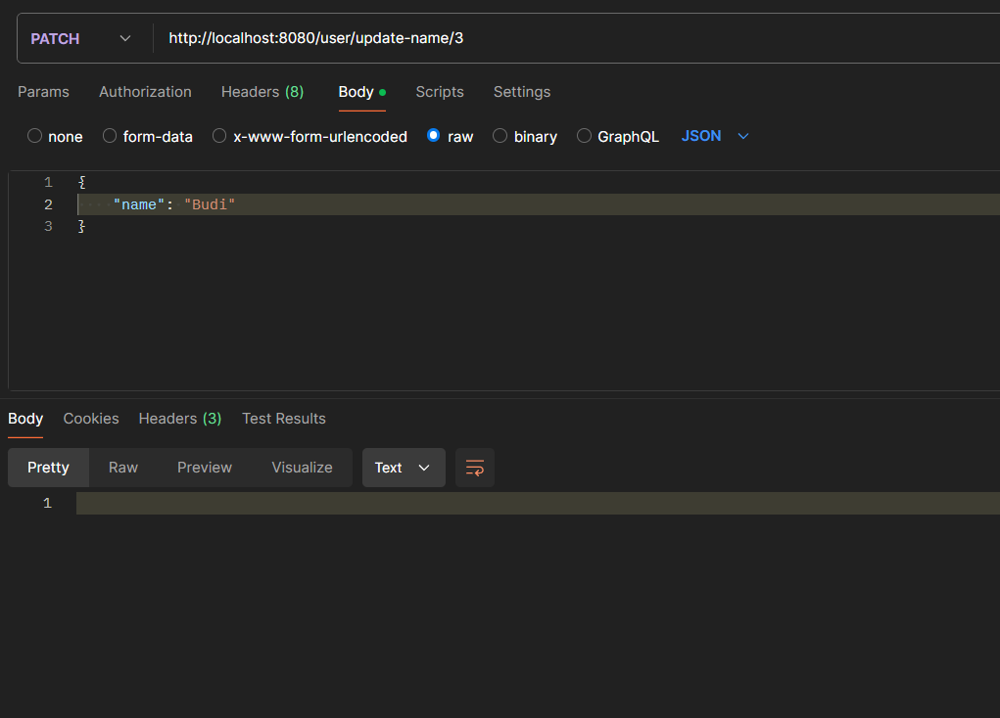
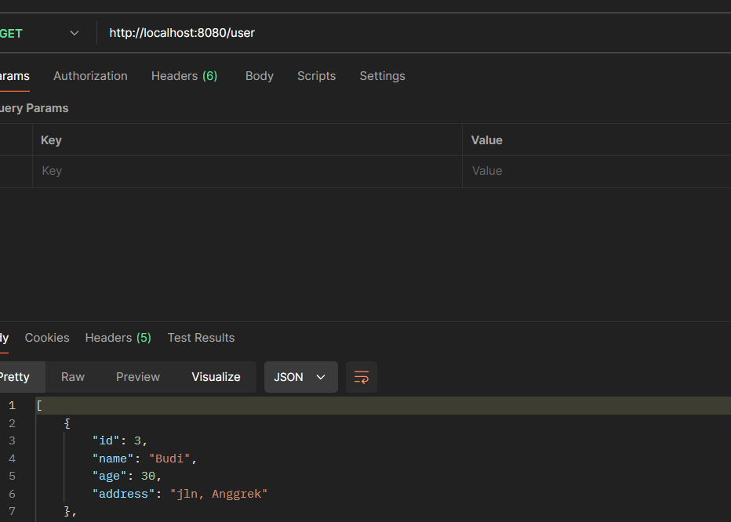

## spring boot CRUD REST API with MYSQL

- Spring Boot: A framework that simplifies the creation of Java applications, particularly for building RESTful web services. It provides an easy way to set up a standalone, production-ready Spring application with minimal configuration.

    | CRUD Operation | Description                            |
    |----------------|--------------------------------------  |
    | **Create**     | Adds a new record to the database.     |
    | **Read**       | Retrieves data from the database.      |
    | **Update**     | Modifies existing data in the database.|
    | **Delete**     | Removes data from the database.        |


- REST API: A type of web service that follows the REST (Representational State Transfer) architectural style. It allows clients to interact with the server using HTTP methods like GET, POST, PUT, and DELETE.

- MySQL: A relational database management system used to store the application’s data. It is connected to the Spring Boot application, enabling the API to perform CRUD operations on the database.

**Controller:** It works on both the model and view. It is used to manage the flow of application, i.e. data flow in the model object and to update the view whenever data is changed.
 
**UserController:**

``` java
package com.lambdacode.Spring_crud.controller;

import com.lambdacode.Spring_crud.dto.UserDTO;
import com.lambdacode.Spring_crud.entity.User;
import com.lambdacode.Spring_crud.service.UserService;
import org.springframework.beans.factory.annotation.Autowired;
import org.springframework.http.ResponseEntity;
import org.springframework.web.bind.annotation.*;

import java.util.List;

@RestController
@RequestMapping("/user")
public class UserController {

    @Autowired
    private UserService userService;

    /**
     * add user
     */

    @PostMapping("/add")
    public String addUser(@RequestBody User user) {
        userService.addUser(user);

        return "success add user";
    }

    /**
     * get users as list
     */

    @GetMapping
    public List<User> getUsers() {
        return userService.getUsers();
    }

    /**
     * get user by id
     */

    @GetMapping("/get")
    public User getUser(@RequestParam Integer id) {
        return userService.getUser(id);
    }

    /**
     * update user
     */

    @PutMapping("/update/{id}")
    public ResponseEntity<Void> updateUser(@PathVariable Integer id, @RequestBody User user) {
        userService.updateUser(id, user);

        return ResponseEntity.noContent().build();
    }

    /**
     * delete user
     */

    @DeleteMapping("delete/{id}")
    public ResponseEntity<Void> deleteUser(@PathVariable Integer id){
        userService.deleteUser(id);

        return ResponseEntity.noContent().build();
    }

    /**
     * update name
     */

    @PatchMapping("/update-name/{id}")
    public ResponseEntity<Void> updateName(@PathVariable Integer id, @RequestBody UserDTO userDTO){
        userService.updateName(id, userDTO);

        return ResponseEntity.noContent().build();
    }

}
```
The UserController class is a REST controller that handles HTTP requests related to user management. It uses the UserService to perform operations such as adding, retrieving, updating, and deleting users. Each method in this class corresponds to a specific CRUD operation or another user-related function.

Annotations
@RestController: This annotation indicates that the class is a Spring MVC controller where every method returns a domain object instead of a view. It combines @Controller and @ResponseBody.

@RequestMapping("/user"): This maps the controller to the base URL path /user, meaning all endpoints in this controller will start with /user.

Dependency Injection
@Autowired: The UserService is automatically injected by Spring, allowing the controller to use its methods for business logic without needing to instantiate it manually.

**UserDTO:**

The UserDTO class is a simple data transfer object used to encapsulate and transfer the name field of a User entity within your Spring Boot application. The @Data annotation from Lombok reduces boilerplate code, making the class concise. DTOs like UserDTO help in maintaining clear boundaries between different layers of your application, improving modularity, security, and clarity in data handling.

``` java
package com.lambdacode.Spring_crud.dto;

import lombok.Data;

@Data
public class UserDTO {
    private String name;
}
```

**User:**

The User class is a JPA entity representing the User table in your database. It includes fields for id, name, age, and address, which correspond to columns in the table. The class uses Lombok annotations like @Data, @NoArgsConstructor, and @AllArgsConstructor to reduce boilerplate code, making the class more concise and easier to maintain. The @Entity annotation marks it as a JPA entity, and the @Id and @GeneratedValue annotations handle the primary key generation.

``` java
package com.lambdacode.Spring_crud.entity;
import jakarta.persistence.Entity;
import jakarta.persistence.GeneratedValue;
import jakarta.persistence.Id;
import lombok.*;

@Data
@Entity
@NoArgsConstructor
@AllArgsConstructor
public class User {
    @Id
    @GeneratedValue
    private Integer id;
    private String name;
    private Integer age;
    private String address;

}
```

**UserRepository:**

The UserRepository interface is a Spring Data JPA repository for managing User entities. It provides built-in CRUD operations and can be extended with custom query methods as needed. By leveraging JpaRepository, you eliminate the need to write boilerplate code for standard database operations, making your code more concise and easier to maintain.

``` java
package com.lambdacode.Spring_crud.repository;

import com.lambdacode.Spring_crud.entity.User;
import org.springframework.data.jpa.repository.JpaRepository;

public interface UserRepository extends JpaRepository<User, Integer> {
}
```

**UserServiceImpl:**

The UserServiceImpl class implements the UserService interface, providing the concrete logic for user management operations in your Spring Boot application. It handles creating, retrieving, updating, and deleting users, as well as updating a user’s name. The class uses the UserRepository for database interactions and includes error handling to manage cases where a user is not found.

``` java
package com.lambdacode.Spring_crud.service.Impl;

import com.lambdacode.Spring_crud.dto.UserDTO;
import com.lambdacode.Spring_crud.entity.User;
import com.lambdacode.Spring_crud.repository.UserRepository;
import com.lambdacode.Spring_crud.service.UserService;
import org.springframework.beans.factory.annotation.Autowired;
import org.springframework.http.HttpStatus;
import org.springframework.stereotype.Service;
import org.springframework.web.server.ResponseStatusException;

import java.util.List;

@Service
public class UserServiceImpl implements UserService {
    @Autowired
    private UserRepository userRepository;

    /**
     * add user
     */
    @Override
    public void addUser(User user) {
        userRepository.save(user);
    }

    /**
     * get users as list
     */
    @Override
    public List<User> getUsers() {
        return userRepository.findAll();
    }

    /**
     * get user by id
     */

    @Override
    public User getUser(Integer id) {
//        check weather the user is in database or not
        User user = userRepository
                .findById(id)
                .orElseThrow(() -> new ResponseStatusException(HttpStatus.NOT_FOUND, "Invalid user Id:" + id));

        return user;
    }

    /**
     * update user
     */

    @Override
    public void updateUser(Integer id, User user) {
//        check weather the user is in database or not
        userRepository
                .findById(id)
                .orElseThrow(() -> new ResponseStatusException(HttpStatus.NOT_FOUND, "Invalid user Id:" + id));

        user.setId(id);

        userRepository.save(user);

    }

    @Override
    public void deleteUser(Integer id) {
//        check weather the user is in database or not
        User user = userRepository
                .findById(id).orElseThrow(() -> new ResponseStatusException(HttpStatus.NOT_FOUND, "Invalid user Id:" + id));

        userRepository.delete(user);
    }

    @Override
    public void updateName(Integer id, UserDTO userDTO) {
//        check weather the user is in database or not
        User user = userRepository
                .findById(id).orElseThrow(() -> new ResponseStatusException(HttpStatus.NOT_FOUND, "Invalid user Id:" + id));

        user.setName(userDTO.getName());

        userRepository.save(user);

    }
}
```

**UserService:**

The UserService interface defines the essential operations for user management within your Spring Boot application. By separating the contract (interface) from the implementation (UserServiceImpl), you adhere to the principles of abstraction and loose coupling, making the application more modular and easier to maintain. The methods in this interface cover all the CRUD operations, as well as a specific operation for updating a user’s name.

``` java
package com.lambdacode.Spring_crud.service;

import com.lambdacode.Spring_crud.dto.UserDTO;
import com.lambdacode.Spring_crud.entity.User;

import java.util.List;

public interface UserService {
    void addUser(User user);

    List<User> getUsers();

    User getUser(Integer id);

    void updateUser(Integer id, User user);

    void deleteUser(Integer id);

    void updateName(Integer id, UserDTO userDTO);
}
```

**SpringCrudApplication:**

The SpringCrudApplication class is the main entry point of your Spring Boot application. It uses the @SpringBootApplication annotation to enable auto-configuration, component scanning, and Spring’s configuration features. The main method starts the application by calling SpringApplication.run, which launches the Spring context and all the necessary components for your application to run.

``` java
package com.lambdacode.Spring_crud;

import org.springframework.boot.SpringApplication;
import org.springframework.boot.autoconfigure.SpringBootApplication;

@SpringBootApplication
public class SpringCrudApplication {

	public static void main(String[] args) {
		SpringApplication.run(SpringCrudApplication.class, args);
	}

}
```

**Application.properties:**

This configuration sets up a Spring Boot application named spring-crud that connects to a MySQL database named employee using JDBC. It configures Hibernate to create and drop the database schema each time the application starts and stops. SQL queries are logged in a readable format for easier debugging. This setup is suitable for development and testing environments, but some properties (like ddl-auto and database credentials) should be adjusted for production use.

``` java
spring.application.name=spring-crud

spring.datasource.driver-class-name=com.mysql.jdbc.Driver
spring.datasource.url=jdbc:mysql://localhost:3306/employee
spring.datasource.username=root
spring.datasource.password=

spring.jpa.hibernate.ddl-auto=create-drop
spring.jpa.show-sql=true
spring.jpa.properties.hibernate.format_sql=true
```


**Output:**













